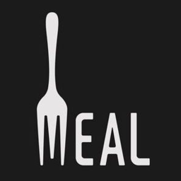
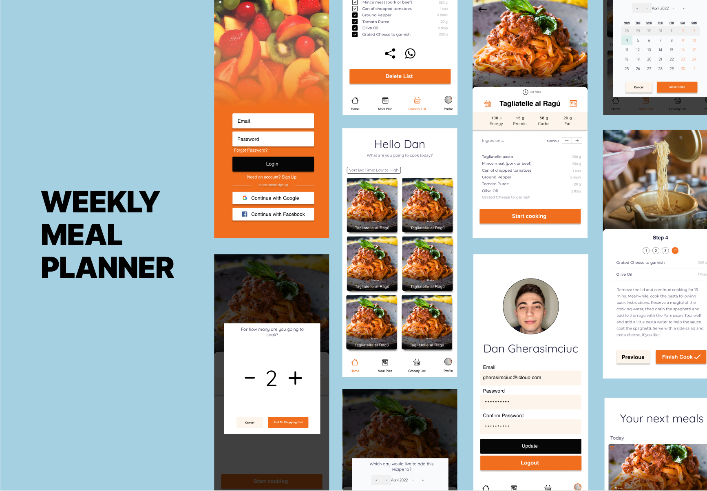
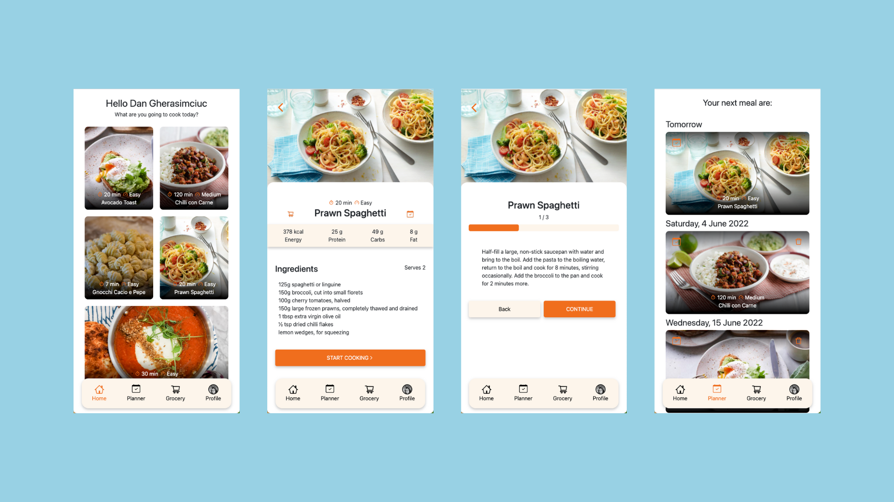
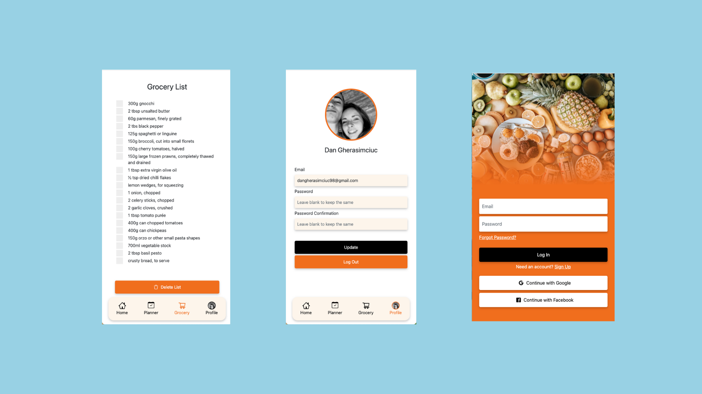
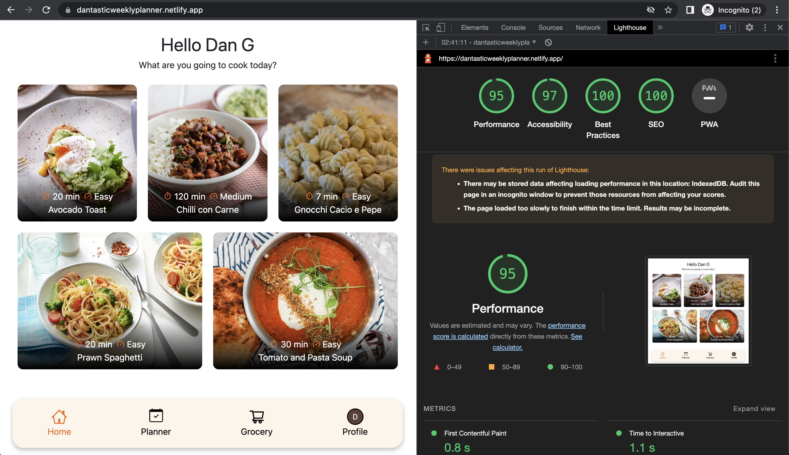

<div id="top"></div>

[![MIT License][license-shield]][license-url]
[![LinkedIn][linkedin-shield]][linkedin-url]

<!-- PROJECT LOGO -->
<br />
<div align="center">
  <a href="https://github.com/DantasticWebSolutions/weekly-planner">
    
  </a>

  <h3 align="center">Dantastic Meal Planner™</h3>

  <p align="center">
    An awesome meal planner to help you live a healtier and more organised life.
    <br />
    <a href="https://dantasticweeklyplanner.netlify.app/" target="_blank">View Demo</a>
    ·
    <a href="mailto:gherasimciuc@icloud.com">Contact Me</a>
  </p>
</div>

<!-- CONTENTS TABLE -->
<details>
  <summary>Table of Contents</summary>
  <ol>
    <li>
      <a href="#about-the-project">About The Project</a>
      <ul>
        <li><a href="#built-with">Built With</a></li>
      </ul>
    </li>
    <li>
      <a href="#getting-started">Getting Started</a>
      <ul>
        <li><a href="#prerequisites">Prerequisites</a></li>
        <li><a href="#installation">Installation</a></li>
      </ul>
    </li>
    <li><a href="#usage">Usage</a></li>
    <li><a href="#roadmap">Roadmap</a></li>
    <li><a href="#license">License</a></li>
    <li><a href="#contact">Contact</a></li>
    <li><a href="#acknowledgments">Acknowledgments</a></li>
  </ol>
</details>

<!-- ABOUT THE PROJECT -->

## About The Project

# 

This project incorporates an assortment of recipes that will enhance your weekly food intake and your grocery organisation skills.

Log in using Google, Facebook or email and password and start planning your healthy journey and your new grocery habits.

Have you ever asked yourself: ‘What am I going to cook today?’ or ‘What was I supposed to buy this time?’. Well, ask no more! From now on, the only thing you will ask yourself will be ‘Why haven’t I started before?’

Here is why:

- Your time should be used doing something great. This will give you back the hours you spend planning
- You will never run out of ingredients anymore
- You will always have a variegated choice of healthy recipes

If it’s true that food can make us unhealthy, it can also take us to be healthy again :mending_heart:

<p align="right">(<a href="#top">back to top</a>)</p>

<!-- BUILT WITH -->

### Built With

List of major frameworks/libraries used to bootstrap this project.

- [React](https://www.npmjs.com/package/react)
- [Firebase](https://www.npmjs.com/package/firebase)
- [Bootstrap](https://www.npmjs.com/package/bootstrap)

<p align="right">(<a href="#top">back to top</a>)</p>

<!-- GETTING STARTED -->

## Getting Started

Instructions on setting up this project locally.
To get a local copy up and running follow these simple example steps.

### Prerequisites

- Intall Node.js
- Install NPM
  ```sh
  npm install npm@latest -g
  ```

### Installation

1. Clone the Repo
   ```sh
   git clone https://github.com/DantasticWebSolutions/weekly-planner.git
   ```
2. Create a .env.local file in the root and paste the following
   ```sh
   REACT_APP_FIREBASE_API_KEY=[YOUR APP_FIREBASE_API_KEY 
   REACT_APP_FIREBASE_AUTH_DOMAIN=[YOUR APP_FIREBASE_API_KEY]
   REACT_APP_FIREBASE_PROJECT_ID=[YOUR APP_FIREBASE_API_KEY]
   REACT_APP_FIREBASE_STORAGE_BUCKET=[YOUR APP_FIREBASE_API_KEY]
   REACT_APP_FIREBASE_MESSAGING_SENDER_ID=[YOUR APP_FIREBASE_API_KEY]
   REACT_APP_FIREBASE_APP_ID=[YOUR APP_FIREBASE_API_KEY]
   ```
3. Install NPM packages
   ```sh
   npm install
   ```
4. Start server and open project
   ```sh
   npm start
   ```
5. Log in with Google, Facebook or the following credentials
   ```sh
   test@gmail.com
   testtest
   ```
   <p align="right">(<a href="#top">back to top</a>)</p>

<!-- USAGE EXAMPLES -->

## Usage

You can add this app to the home screen by simply creating a bookmark from your preferred browser. In the future, you will be able to download from the main application stores.

After logging in, you can tap on any recipe to get more details and start planning. Tap one of the two buttons on the sides of the title to either add to the shopping list or add to the calendar. You can also see all the steps required for the recipes once you press “Start Cooking” on the chosen recipe.

# 

Once you have added recipes to the weekly planner, you don’t need to delete the recipes once the date has passed. However, you can still change the date or delete the planned recipe by pressing one of the buttons on the top corners of the recipe itself.

As soon as you finish buying the ingredients you need, you can tap the specific ingredient to cross it or delete the whole grocery list by simply clicking the main delete button at the end. Once you finished planning, you can log out or change your password from the Profile section.

# 

The performance reached during the LightRoom testing proves the app works as supposed in a web browser

# 

_Please refer to the [Documentation](https://github.com/DantasticWebSolutions/weekly-planner/blob/main/documentation.md) for a complete description of the purpose of this project_

<p align="right">(<a href="#top">back to top</a>)</p>

<!-- ROADMAP -->

## Roadmap

- [x] Login System
- [x] Create and Display Recipes
- [x] Add Recipe to Shopping List
- [x] Add Recipe to Weekly Planner
- [ ] Share Shopping List
- [ ] Order Recipes by time, difficulty or macronutrients informations
- [ ] Filter Vegan or Vegetarian options
- [ ] Macronutrients Counter
- [ ] Display Recipes based on the remaining macronutrients needed to complete goals
- [ ] Allow Users to create their own Recipes (visible only to the user who created it)
- [ ] Displaying Recipes based on ingredients user already have
- [ ] Multi-language Support
  - [x] English
  - [ ] Italian
  - [ ] Spanish
  - [ ] French
- [ ] Create Native app to be published to App Store and Google Play

<p align="right">(<a href="#top">back to top</a>)</p>

<!-- LICENSE -->

## License

Distributed under the MIT License. See `LICENSE.txt` for more information.

<p align="right">(<a href="#top">back to top</a>)</p>

<!-- CONTACT -->

## Contact

Dan Gherasimciuc
[@dangherasimciuc](https://www.linkedin.com/in/dangherasimciuc/) \
Send me an email at: [gherasimciuc@icloud.com](mailto:gherasimciuc@icloud.com) \
Project Link: [https://github.com/DantasticWebSolutions/weekly-planner](https://github.com/DantasticWebSolutions/weekly-planner)

<p align="right">(<a href="#top">back to top</a>)</p>

<!-- ACKNOWLEDGMENTS -->

## Acknowledgments

List of resources I find helpful and would like to give credit to:

- [React Bootstrap](https://www.npmjs.com/package/react-bootstrap)
- [React Router Dom](https://reactrouter.com/)
- [React Notifications](https://www.npmjs.com/package/react-notifications)
- [React Calendar](https://www.npmjs.com/package/react-calendar)
- [React Icons](https://www.npmjs.com/package/react-icons)
- [React Confirm Alert](https://www.npmjs.com/package/react-confirm-alert)
- [Luxon](https://moment.github.io/luxon/)
- [Netlify](https://www.netlify.com/)
- [React Icons](https://react-icons.github.io/react-icons/search)
- [Choose an Open Source License](https://choosealicense.com)

<p align="right">(<a href="#top">back to top</a>)</p>

<!-- LINKS & IMAGES -->

[license-shield]: https://img.shields.io/github/license/othneildrew/Best-README-Template.svg?style=for-the-badge
[license-url]: https://github.com/DantasticWebSolutions/weekly-planner/blob/main/LICENSE.txt
[linkedin-shield]: https://img.shields.io/badge/-LinkedIn-black.svg?style=for-the-badge&logo=linkedin&colorB=555
[linkedin-url]: https://www.linkedin.com/in/dangherasimciuc/
