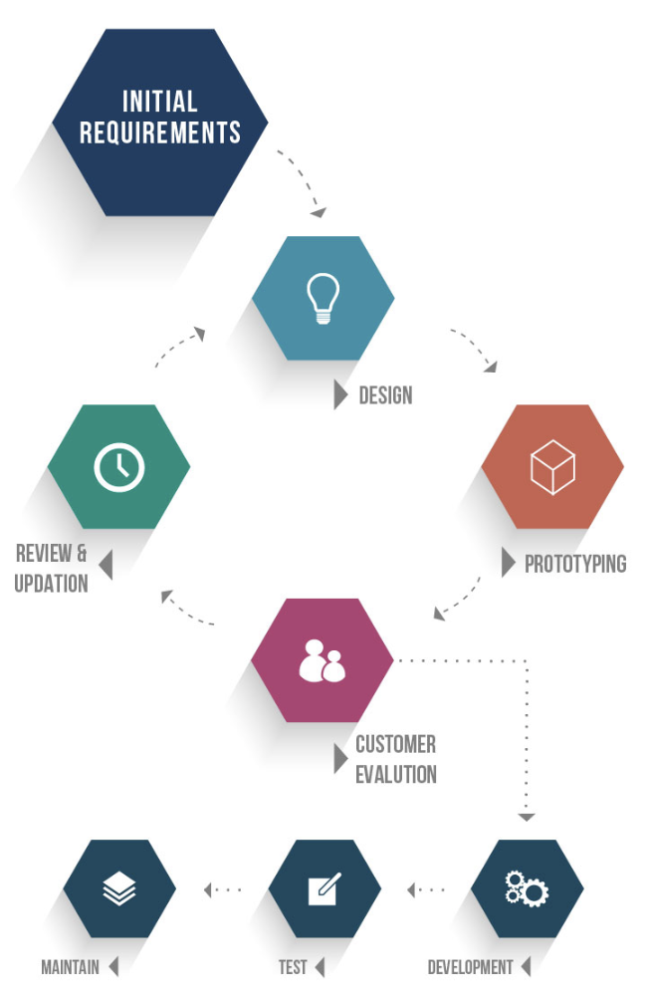
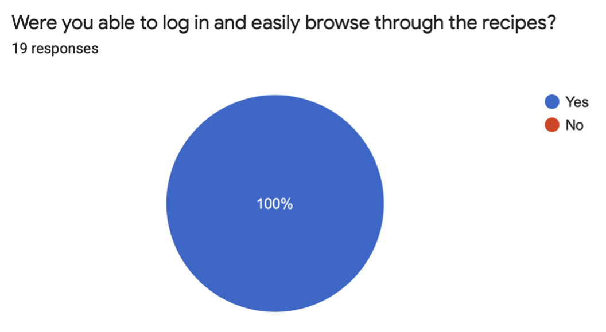
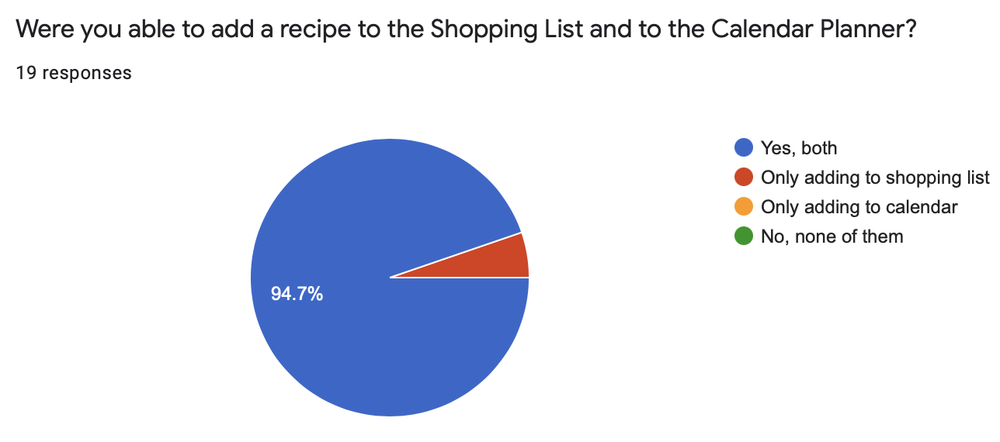
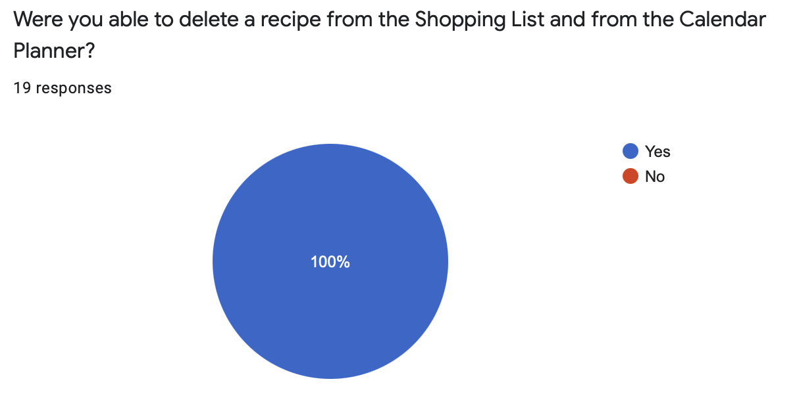
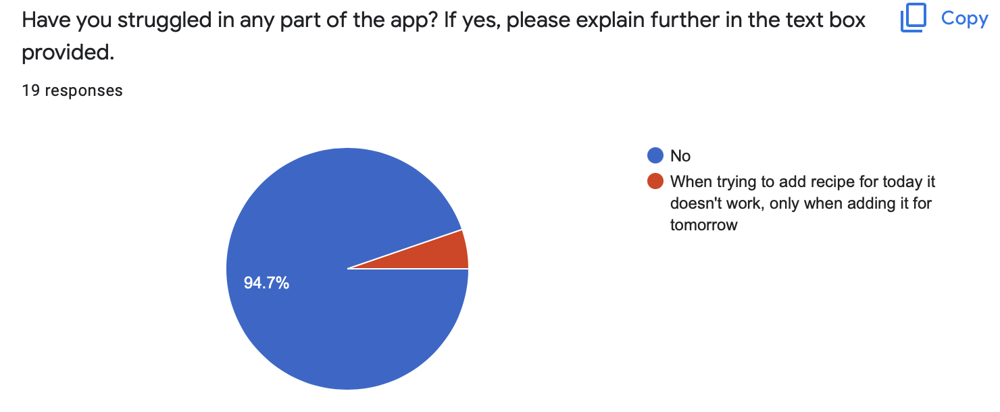
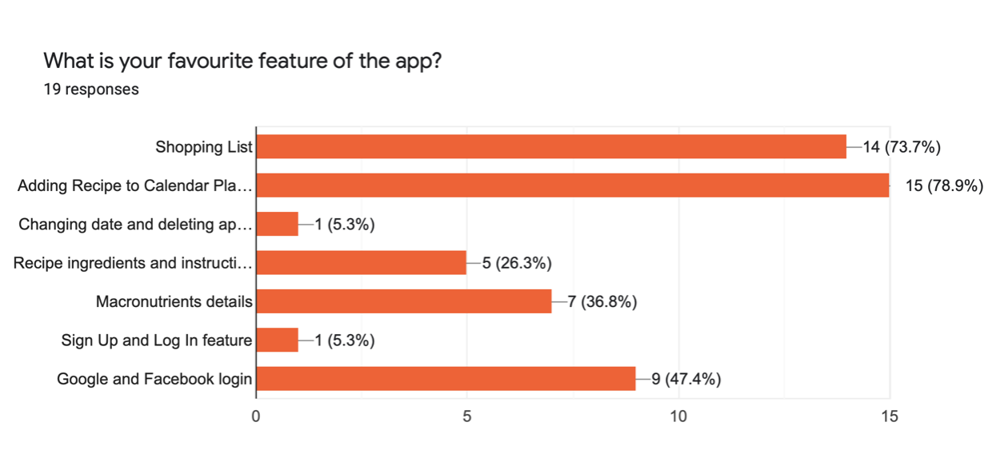
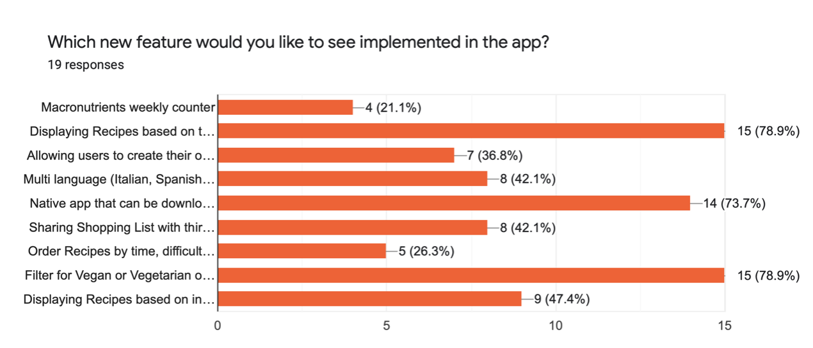
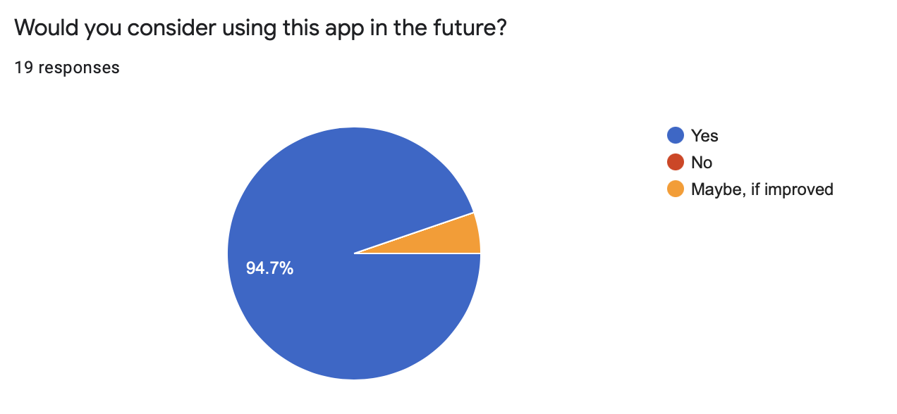
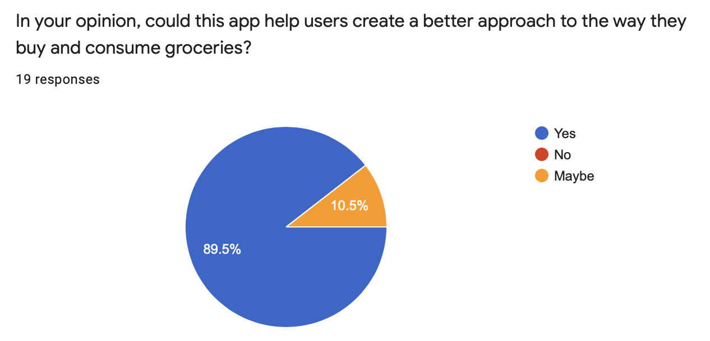
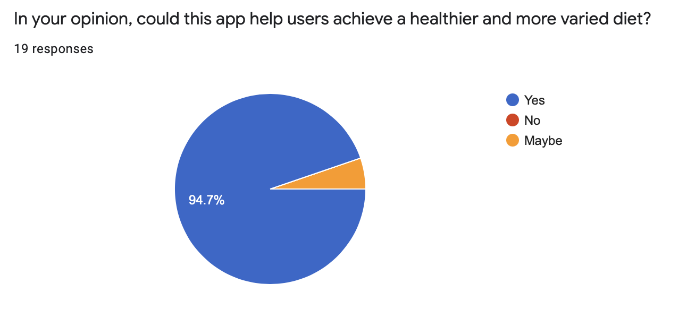

#  
# Dantastic Meal Planner™
Powered by Dan Gherasimciuc - 10104066 \
Hosted Website: https://dantasticweeklyplanner.netlify.app \
Github Source Code: https://github.com/DantasticWebSolutions/weekly-planner 

# Introduction

Students nowadays have to juggle several activities and it is difficult to perform at the best in all of them, especially for the unexperienced younger ones. For this reason, students must organise themselves in the most optimal way possible to avoid losing time and perform excellently at the same time. Usually this implies they will have to dedicate more time to the essential tasks and less to others, sometimes leading to completely ignore the less significant ones. For some students, a task that is usually considered secondary is taking care of their health through the food they eat. Most students have poor diets, usually fast-food products, which increase their food expenses, which also cause health problems in the long run.

The aim of this web app is to solve the problems identified in the first three stages of the design thinking process. The ideation of this prototype occurred when trying to provide a hypothesise on how to solve students’ lack of organisation and equipping them with a platform where they can plan their meals during the week, get nutritional informations about the food and create an organised and methodical shopping list.

This phase is an experimental stage where I had to produce the platform that could offer a solution to the obstacles found. The goal of this phase is to understand the user’s behaviour and interaction with the end products.
The ultimate phase is to test the outcome of the decision taken in the previous stages. This will aim to gather more data about the users’ behaviour and needs and therefore redefine the stages and tackle the additional problems in the same systematic way that have been approached the first time.

This app has an obvious purpose of helping students during meal preparation or grocery shopping. Most of the time, users will use this app while moving through shops or while focused on something else, like cooking, hence the decision to use a mobile first approach. Therefore, a mobile first design and prototyping have been prioritized in order to give the best performance when the user needs those features the most.

# Methodology

#  

The method I have chosen is the Prototype Methodology, which is a software development process that aims to let the developer create only the prototype of the solution in order to express the functionalities to the client or user. There are many advantages that occur when using this approach, and hence the reason for using it for this project. This process allows the developer to get a clear understanding of the users’ needs and it allows him to achieve a higher level of customer satisfaction. Furthermore, this process allows to easily identify the required changes and to accordingly make changes in order to fulfil these requirements. Proceeding with this method ensures a significant reduction in the risk of failure and it also allows to identify these risks in early stages in order to avoid extensive complications in later stages. Another advantage that this process generates is the great communication that gets established between the development team and the client, which leads to a higher level of overall satisfaction.

### Methods
This prototype proposed has been evaluated by the users using an online questionnaire that required them to use the app with no previous knowledge about how to use it. The purpose was to understand the user behaviour and find any problems in the way they approach and use the web-app. The choice of a questionnaire has been implemented because of its ability to transform data into quantitatively provable results.

The questionnaire comprised 10 questions meant to understand the users’ interaction with the app and see if any of the problems established during the first steps of the Design Thinking method can be solved with the proposed prototype.

# Conclusion/Results

The results from the questionnaire brought a promising outcome. Since all the students agreed with the potential usefulness of the app, I can argue this app could improve the way young people and especially students, approach diets, grocery and personal macronutrients intake. 

#  
#  
#  
#  

All the users have been proven able to create an account, log in and use recipes without prior explanation or tour through the app. Furthermore, the most of interviewed individuals have been able to add recipes to the shopping list and calendar in an easy and approachable manner. When asking users if they have struggled while using the app, most of the users answered negatively, however one student found a bug which doesn’t allow user to plan recipes for the current day’s date. For this reason I have decided to implement the prototype methodology to repeat the process from the design step forward. This allowed me to plan the approach and resolve the bug. 

#  

From the user’s questionnaire I have realised the preferred features are the ability to add recipes to the Shopping List and adding recipes to the Calendar Planner. However, the possibility of logging with third-party providers like Google and Facebook has achieved a significant success. 

#  

Next when users have been asked to choose between new features they would like to be implemented the preferred one was the ability to choose between recipes that help to achieve the weekly macronutrients goal (like 3000kcal/day). This feature in fact would make users more aware of the actual intake they are getting and how act in order to get healthier and more organised. Next users would like the possibility to filter recipes based on the nature of the ingredients, like recipes with only vegetarian or vegan products. Another main feature students would like is the possibility to download the app from the main application stores available at the moment (App Store, Google Play).

#  
#  
#  

Finally the users have been asked if they would use the app and if in their opinion this could help achieving a healthier and more organised lifestyle. All the answers were very promising. In fact 90% of interviewed students have stated they belive the app can help them achieve a healthier lifestyle.

In conclusion, based on the questionnaire’s results, this app is highly likely to help students solve the problem identified in the first stages of the studies performed in the Design Thinking Process (during the first assignment AE1). 

# Appendix

[Figma design Project](https://www.figma.com/file/kIQUiAkFknaj58zUyVi8rj/Meals-and-Shopping-List-weekly-planner?node-id=0%3A1)

### Technologies: 
- [React](https://www.npmjs.com/package/react)
- [Firebase](https://www.npmjs.com/package/firebase)
- [Bootstrap](https://www.npmjs.com/package/bootstrap)
- [React Bootstrap](https://www.npmjs.com/package/react-bootstrap)  
- [React Router Dom](https://reactrouter.com/)
- [React Notifications](https://www.npmjs.com/package/react-notifications)
- [React Calendar](https://www.npmjs.com/package/react-calendar)
- [React Icons](https://www.npmjs.com/package/react-icons)
- [React Confirm Alert](https://www.npmjs.com/package/react-confirm-alert)
- [Luxon](https://moment.github.io/luxon/)

#

